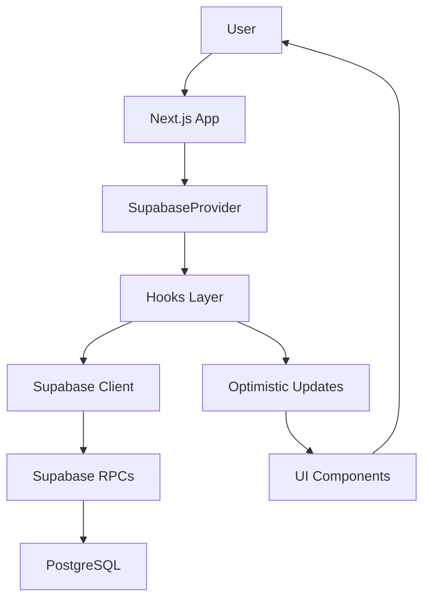
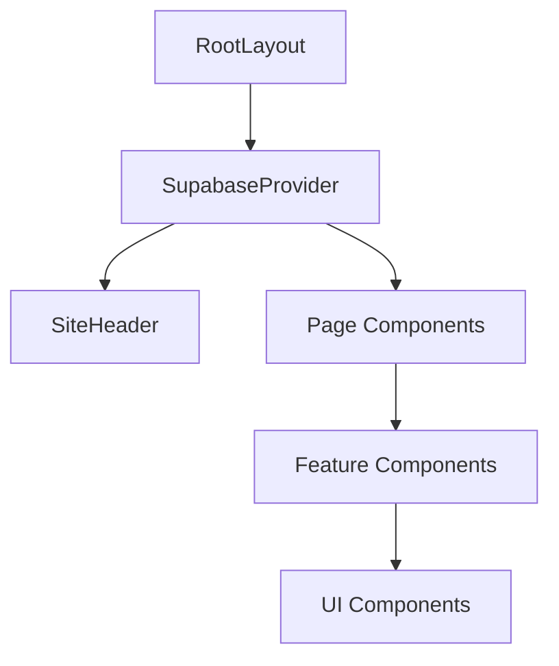

# Comprehensive Code Review – CambioCromos Web
**Date**: 2025-10-08
**Reviewer**: Claude Code
**Scope**: Full repository review (performance, maintainability, scalability, best practices)

---

## Executive Summary

The codebase is **well-structured** with clear separation of concerns, good TypeScript usage, and solid RPC-first architecture. However, there are several opportunities to improve **performance**, **maintainability**, and **scalability** before the v1.5.0 sprint.

**Overall Grade**: B+ (Good, with room for optimization)

**Key Strengths**:
- ✅ Clean architecture with hooks-based state management
- ✅ Strong TypeScript typing with generated database types
- ✅ RPC-first approach reduces client-side complexity
- ✅ Optimistic updates for excellent UX
- ✅ Good component composition patterns

**Key Areas for Improvement**:
- ⚠️ Duplicate Supabase client instances
- ⚠️ N+1 query patterns in hooks (useProfileData, useAlbumPages)
- ⚠️ Large hook files (useAlbumPages: 876 lines)
- ⚠️ Missing error boundaries
- ⚠️ 66 console.log statements (production logging strategy needed)
- ⚠️ No request caching or memoization strategy
- ⚠️ Missing performance monitoring

---

## 🔴 Critical Issues (Fix Before v1.5.0)

### 1. **Duplicate Supabase Client Instances** ⚠️ HIGH PRIORITY

**Issue**: Two separate Supabase client instances are created:
- `src/lib/supabase/client.ts` (exported as `supabase`)
- `src/components/providers/SupabaseProvider.tsx` (exported as `supabase` from context)

**Impact**:
- Memory waste (2 WebSocket connections, 2 auth listeners)
- Potential state inconsistencies
- Confusion about which client to use

**Location**:
```typescript
// src/lib/supabase/client.ts:14
export const supabase = createClient(supabaseUrl, supabaseAnonKey, {...});

// src/components/providers/SupabaseProvider.tsx:14
export const supabase = createClient(supabaseUrl, supabaseAnonKey, {...});
```

**Fix**:
```typescript
// 1. Remove src/lib/supabase/client.ts entirely
// 2. Always use: const { supabase } = useSupabase();
// 3. For server-side or scripts, create a separate createServerClient() helper
```

**Files to Update**:
- Delete `src/lib/supabase/client.ts`
- Audit all imports and replace with `useSupabase()` hook

---

### 2. **N+1 Query Pattern in useProfileData** ⚠️ PERFORMANCE

**Issue**: Sequential RPC calls inside `Promise.all` for collection stats.

**Location**: `src/hooks/profile/useProfileData.ts:243-278`

```typescript
const ownedWithStats = await Promise.all(
  (userCollectionsData || []).map(async (uc) => {
    // ...
    const { data: statsData } = await supabase.rpc(
      'get_user_collection_stats',
      { p_user_id: user.id, p_collection_id: collection.id }
    );
    // ...
  })
);
```

**Problem**: If a user has 5 collections, this makes 5 separate RPC calls. While `Promise.all` runs them in parallel, it's still inefficient.

**Impact**:
- **5 collections** = 5 RPC calls = ~500-1000ms
- **10 collections** = 10 RPC calls = ~1000-2000ms
- Scales linearly with collection count

**Fix**: Create a batch RPC function:

```sql
-- In Supabase
CREATE OR REPLACE FUNCTION get_multiple_user_collection_stats(
  p_user_id UUID,
  p_collection_ids BIGINT[]
)
RETURNS TABLE (
  collection_id BIGINT,
  total_stickers INT,
  owned_stickers INT,
  completion_percentage INT,
  duplicates INT,
  missing INT
) AS $$
BEGIN
  RETURN QUERY
  SELECT
    c.id AS collection_id,
    COUNT(s.id)::INT AS total_stickers,
    COUNT(DISTINCT CASE WHEN us.count > 0 THEN s.id END)::INT AS owned_stickers,
    ROUND((COUNT(DISTINCT CASE WHEN us.count > 0 THEN s.id END)::NUMERIC / NULLIF(COUNT(s.id), 0)) * 100)::INT AS completion_percentage,
    COALESCE(SUM(GREATEST(us.count - 1, 0)), 0)::INT AS duplicates,
    (COUNT(s.id) - COUNT(DISTINCT CASE WHEN us.count > 0 THEN s.id END))::INT AS missing
  FROM collections c
  LEFT JOIN stickers s ON s.collection_id = c.id
  LEFT JOIN user_stickers us ON us.sticker_id = s.id AND us.user_id = p_user_id
  WHERE c.id = ANY(p_collection_ids)
  GROUP BY c.id;
END;
$$ LANGUAGE plpgsql SECURITY DEFINER;
```

```typescript
// Then in useProfileData.ts:
const collectionIds = validCollections.map(c => c.id);
const { data: allStats } = await supabase.rpc(
  'get_multiple_user_collection_stats',
  { p_user_id: user.id, p_collection_ids: collectionIds }
);

// Map stats back to collections (1 RPC call instead of N)
const ownedWithStats = validCollections.map(collection => {
  const stats = allStats.find(s => s.collection_id === collection.id);
  return { ...collection, stats };
});
```

**Estimated Performance Gain**: 5-10x faster for multi-collection users

---

### 3. **Same N+1 Pattern in useAlbumPages (softRefresh)** ⚠️ PERFORMANCE

**Location**: `src/hooks/album/useAlbumPages.ts:339-374`

Same issue as above. Use the batch RPC.

---

## 🟡 High Priority Issues (Fix During v1.5.0)

### 4. **Missing Error Boundaries**

**Issue**: No React Error Boundaries in the app. A single unhandled error in any component crashes the entire app.

**Impact**: Poor UX, no graceful degradation

**Fix**: Add error boundaries:

```typescript
// src/components/ErrorBoundary.tsx
'use client';

import React from 'react';
import { AlertTriangle } from 'lucide-react';
import { Button } from '@/components/ui/button';

interface Props {
  children: React.ReactNode;
  fallback?: React.ReactNode;
}

interface State {
  hasError: boolean;
  error: Error | null;
}

export class ErrorBoundary extends React.Component<Props, State> {
  constructor(props: Props) {
    super(props);
    this.state = { hasError: false, error: null };
  }

  static getDerivedStateFromError(error: Error): State {
    return { hasError: true, error };
  }

  componentDidCatch(error: Error, errorInfo: React.ErrorInfo) {
    console.error('ErrorBoundary caught:', error, errorInfo);
    // TODO: Send to error tracking service (Sentry, LogRocket, etc.)
  }

  render() {
    if (this.state.hasError) {
      if (this.props.fallback) {
        return this.props.fallback;
      }

      return (
        <div className="min-h-screen flex items-center justify-center bg-[#1F2937] px-4">
          <div className="max-w-md w-full bg-white dark:bg-gray-800 rounded-lg p-6 text-center">
            <AlertTriangle className="w-16 h-16 text-red-500 mx-auto mb-4" />
            <h1 className="text-2xl font-bold mb-2">Algo salió mal</h1>
            <p className="text-gray-600 dark:text-gray-400 mb-4">
              Lo sentimos, ha ocurrido un error inesperado.
            </p>
            <Button
              onClick={() => {
                this.setState({ hasError: false, error: null });
                window.location.href = '/';
              }}
            >
              Volver al inicio
            </Button>
          </div>
        </div>
      );
    }

    return this.props.children;
  }
}
```

**Usage in layout.tsx**:
```typescript
import { ErrorBoundary } from '@/components/ErrorBoundary';

export default function RootLayout({ children }) {
  return (
    <html lang="es">
      <body>
        <SupabaseProvider>
          <ErrorBoundary>
            <SiteHeader />
            <main>{children}</main>
            <footer>...</footer>
          </ErrorBoundary>
          <Toaster />
        </SupabaseProvider>
      </body>
    </html>
  );
}
```

---

### 5. **Massive Hook Files (Violates SRP)**

**Issue**: `useAlbumPages.ts` is **876 lines** – far too large for a single hook.

**Location**: `src/hooks/album/useAlbumPages.ts`

**Impact**:
- Hard to test
- Hard to understand
- Hard to maintain
- Violates Single Responsibility Principle

**Fix**: Split into smaller, focused hooks:

```typescript
// src/hooks/album/useAlbumPages.ts (keep orchestration)
// src/hooks/album/useAlbumPageContent.ts (fetchPageContent logic)
// src/hooks/album/useAlbumSummary.ts (fetchCollectionStats logic)
// src/hooks/album/useAlbumCollectionSwitch.ts (switchCollection logic)
// src/hooks/album/useAlbumStickerActions.ts (markStickerOwned, reduceStickerOwned, markPageComplete)
```

**Example refactor**:
```typescript
// useAlbumPages.ts (orchestrator)
export function useAlbumPages(collectionId: number | null, pageId: string | null) {
  const pageContent = useAlbumPageContent(collectionId, pageId);
  const summary = useAlbumSummary(collectionId);
  const stickerActions = useAlbumStickerActions(collectionId, pageContent.currentPage);
  const collectionSwitch = useAlbumCollectionSwitch();

  return {
    ...pageContent,
    ...summary,
    ...stickerActions,
    ...collectionSwitch,
  };
}
```

**Benefits**:
- Each hook < 200 lines
- Easier to test in isolation
- Better code reuse
- Easier to understand

---

### 6. **No Request Caching / Deduplication**

**Issue**: Multiple components may fetch the same data simultaneously without deduplication.

**Example**: If 3 components all call `get_user_collection_stats` for collection ID 1 within 100ms, you make 3 identical RPC calls.

**Fix**: Implement a query cache layer (recommend **TanStack Query** / React Query):

```bash
npm install @tanstack/react-query
```

```typescript
// src/providers/QueryProvider.tsx
'use client';

import { QueryClient, QueryClientProvider } from '@tanstack/react-query';
import { ReactQueryDevtools } from '@tanstack/react-query-devtools';
import { useState } from 'react';

export function QueryProvider({ children }: { children: React.ReactNode }) {
  const [queryClient] = useState(
    () =>
      new QueryClient({
        defaultOptions: {
          queries: {
            staleTime: 1000 * 60, // 1 minute
            gcTime: 1000 * 60 * 5, // 5 minutes (formerly cacheTime)
            retry: 1,
            refetchOnWindowFocus: false,
          },
        },
      })
  );

  return (
    <QueryClientProvider client={queryClient}>
      {children}
      <ReactQueryDevtools initialIsOpen={false} />
    </QueryClientProvider>
  );
}
```

**Example migration**:
```typescript
// Before (useProfileData.ts)
const fetchCollectionStats = async () => {
  const { data } = await supabase.rpc('get_user_collection_stats', {...});
  // ...
};

// After
import { useQuery } from '@tanstack/react-query';

const { data: stats, isLoading, error } = useQuery({
  queryKey: ['collection-stats', userId, collectionId],
  queryFn: async () => {
    const { data } = await supabase.rpc('get_user_collection_stats', {
      p_user_id: userId,
      p_collection_id: collectionId,
    });
    return normalizeCollectionStats(data);
  },
  enabled: !!userId && !!collectionId,
});
```

**Benefits**:
- Automatic request deduplication
- Built-in caching
- Automatic background refetching
- Optimistic updates built-in
- DevTools for debugging

---

### 7. **Console.log Statements in Production**

**Issue**: **66 console statements** in the codebase. Many will run in production.

**Impact**:
- Performance overhead (console.log is slow)
- Potential security leak (sensitive data logged)
- Noise in production logs

**Fix**: Replace with a logging utility:

```typescript
// src/lib/logger.ts
const isDev = process.env.NODE_ENV === 'development';

export const logger = {
  debug: (...args: unknown[]) => {
    if (isDev) console.debug(...args);
  },
  info: (...args: unknown[]) => {
    if (isDev) console.info(...args);
  },
  warn: (...args: unknown[]) => {
    console.warn(...args);
  },
  error: (...args: unknown[]) => {
    console.error(...args);
    // TODO: Send to error tracking service
  },
};
```

**Find & Replace**:
```bash
# Find all console.log
grep -r "console\." src/ --include="*.ts" --include="*.tsx"

# Replace with logger
console.log(...) → logger.debug(...)
console.error(...) → logger.error(...)
```

---

## 🟢 Medium Priority Issues (Post v1.5.0)

### 8. **No Component-Level Code Splitting**

**Issue**: All pages are loaded on initial bundle. No dynamic imports for heavy components.

**Impact**: Larger initial bundle size, slower Time to Interactive (TTI)

**Fix**: Use Next.js `dynamic()` for heavy components:

```typescript
// src/app/trades/compose/page.tsx
import dynamic from 'next/dynamic';

const TradeComposer = dynamic(
  () => import('@/components/trades/TradeComposer'),
  {
    loading: () => <TradeComposerSkeleton />,
    ssr: false, // If component uses browser APIs
  }
);

export default function ComposePage() {
  return <TradeComposer />;
}
```

**Recommended for**:
- Trade composer (complex)
- Album page grid (image-heavy)
- Profile page (infrequently accessed)

---

### 9. **No Image Optimization Strategy**

**Issue**: Images are loaded via Supabase Storage public URLs without Next.js Image component optimization.

**Current**:
```typescript

```

**Fix**: Use `next/image` with Supabase loader:

```typescript
// next.config.ts
const nextConfig: NextConfig = {
  images: {
    remotePatterns: [
      {
        protocol: 'https',
        hostname: '**.supabase.co',
        pathname: '/storage/v1/object/public/sticker-images/**',
      },
    ],
    formats: ['image/webp', 'image/avif'],
    deviceSizes: [640, 750, 828, 1080, 1200],
    imageSizes: [16, 32, 48, 64, 96, 128, 256, 384],
  },
};
```

```typescript
import Image from 'next/image';

<Image
  src={sticker.image_public_url}
  alt={sticker.player_name}
  width={300}
  height={420}
  loading="lazy"
  placeholder="blur"
  blurDataURL="/placeholder-sticker.jpg"
/>
```

**Benefits**:
- Automatic WebP/AVIF conversion
- Lazy loading
- Responsive images
- Blur-up placeholders
- Faster LCP (Largest Contentful Paint)

---

### 10. **Missing Indexes in TypeScript Types**

**Issue**: Types are manually maintained in `src/types/index.ts` instead of auto-generated from Supabase schema.

**Fix**: Use Supabase CLI to generate types:

```bash
npx supabase gen types typescript --project-id your-project-ref > src/types/database.types.ts
```

**Update imports**:
```typescript
// Before
import { Collection, Sticker } from '@/types';

// After
import type { Database } from '@/types/database.types';
type Collection = Database['public']['Tables']['collections']['Row'];
type Sticker = Database['public']['Tables']['stickers']['Row'];
```

**Add to package.json**:
```json
{
  "scripts": {
    "types:generate": "supabase gen types typescript --project-id your-ref > src/types/database.types.ts"
  }
}
```

**Benefits**:
- Always in sync with database
- Catch breaking changes early
- Better autocomplete

---

### 11. **No Loading State Skeletons for Critical Paths**

**Issue**: Many pages show "Cargando..." text instead of skeleton loaders.

**Example**: `src/app/page.tsx:13-17`

```typescript
if (loading) {
  return (
    <div className="min-h-screen bg-[#1F2937] flex items-center justify-center">
      <div className="text-white text-xl font-bold">Cargando...</div>
    </div>
  );
}
```

**Fix**: Use skeleton components:

```typescript
// src/components/skeletons/AlbumGridSkeleton.tsx
export function AlbumGridSkeleton() {
  return (
    <div className="grid grid-cols-4 gap-4">
      {Array.from({ length: 20 }).map((_, i) => (
        <div
          key={i}
          className="aspect-[3/4] bg-gray-700 animate-pulse rounded-lg"
        />
      ))}
    </div>
  );
}
```

**Benefits**:
- Perceived performance improvement
- Better UX
- Users know content is loading

---

### 12. **Inconsistent Error Handling**

**Issue**: Some hooks return `error` state, others throw, others silently fail.

**Examples**:
- `useProfileData`: Returns `error` state
- `useCollectionActions`: Shows toast, no error return
- `useAlbumPages`: Returns `error` state

**Fix**: Standardize error handling:

```typescript
// Pattern 1: For data-fetching hooks
export function useProfileData() {
  const [data, setData] = useState(null);
  const [loading, setLoading] = useState(true);
  const [error, setError] = useState<Error | null>(null);

  // Return { data, loading, error }
}

// Pattern 2: For action hooks
export function useCollectionActions() {
  const addCollection = async (id: number) => {
    try {
      // ... optimistic update
      await supabase.from('user_collections').insert({...});
      toast.success('Colección añadida');
    } catch (error) {
      // ... rollback
      toast.error('Error al añadir colección');
      throw error; // Re-throw for caller to handle if needed
    }
  };

  // Return { addCollection, loading }
}
```

---

## 🔵 Low Priority Issues (Technical Debt)

### 13. **Unused Imports and Dead Code**

**Issue**: Found several unused imports and variables.

**Example**: `src/types/useCreateProposal.ts` (0 lines, empty file)

**Fix**: Run ESLint with auto-fix:

```bash
npm run lint -- --fix
```

**Add to CI**:
```yaml
# .github/workflows/lint.yml
- name: Lint
  run: npm run lint
```

---

### 14. **Inconsistent Naming Conventions**

**Issue**: Mix of camelCase, PascalCase, and kebab-case in file names.

**Examples**:
- `src/components/nav-link.tsx` (kebab-case)
- `src/components/AuthGuard.tsx` (PascalCase)
- `src/lib/collectionStats.ts` (camelCase)

**Fix**: Standardize:
- **Components**: PascalCase (`AuthGuard.tsx`, `NavLink.tsx`)
- **Hooks**: camelCase (`useProfileData.ts`)
- **Utils**: camelCase (`collectionStats.ts`)
- **Pages**: kebab-case (`mi-coleccion/[id]/page.tsx`) ← Next.js convention

---

### 15. **No Performance Monitoring**

**Issue**: No tracking of Web Vitals (LCP, FID, CLS, TTFB).

**Fix**: Add Vercel Speed Insights (if on Vercel):

```bash
npm install @vercel/speed-insights
```

```typescript
// src/app/layout.tsx
import { SpeedInsights } from '@vercel/speed-insights/next';

export default function RootLayout({ children }) {
  return (
    <html>
      <body>
        {children}
        <SpeedInsights />
      </body>
    </html>
  );
}
```

**Alternative**: Google Analytics 4 with Web Vitals:

```typescript
// src/lib/analytics.ts
export function sendWebVitals(metric: NextWebVitalsMetric) {
  if (window.gtag) {
    window.gtag('event', metric.name, {
      value: Math.round(metric.value),
      event_category: 'Web Vitals',
      event_label: metric.id,
      non_interaction: true,
    });
  }
}
```

---

### 16. **No Database Connection Pooling Visibility**

**Issue**: Supabase client uses default pooling, but no monitoring of connection usage.

**Recommendation**: Add logging in development:

```typescript
// src/components/providers/SupabaseProvider.tsx
if (process.env.NODE_ENV === 'development') {
  supabase.auth.onAuthStateChange((event, session) => {
    console.log('[Auth Event]', event, session?.user?.email);
  });
}
```

---

## 🏗️ Architecture Recommendations

### 17. **Consider Feature-Based Folder Structure (for v1.5.0+)**

**Current**: Layer-based structure (components/, hooks/, types/)

**Proposal**: Feature-based structure for better scalability:

```
src/
├── features/
│   ├── auth/
│   │   ├── components/
│   │   ├── hooks/
│   │   ├── types.ts
│   │   └── index.ts
│   ├── collections/
│   │   ├── components/
│   │   ├── hooks/
│   │   ├── types.ts
│   │   └── index.ts
│   ├── trades/
│   │   ├── components/
│   │   ├── hooks/
│   │   ├── types.ts
│   │   └── index.ts
│   ├── album/
│   └── profile/
├── shared/
│   ├── components/ (ui components)
│   ├── hooks/
│   ├── lib/
│   └── types/
└── app/ (Next.js routes)
```

**Benefits**:
- Co-locate related code
- Easier to find files
- Better for large teams
- Easier to split into micro-frontends later

---

### 18. **Add API Rate Limiting Client-Side**

**Issue**: No protection against accidental API spam (e.g., rapid clicking).

**Fix**: Add debounce/throttle to expensive operations:

```typescript
// src/hooks/useDebounce.ts
import { useEffect, useState } from 'react';

export function useDebounce<T>(value: T, delay: number): T {
  const [debouncedValue, setDebouncedValue] = useState<T>(value);

  useEffect(() => {
    const handler = setTimeout(() => {
      setDebouncedValue(value);
    }, delay);

    return () => {
      clearTimeout(handler);
    };
  }, [value, delay]);

  return debouncedValue;
}
```

**Usage in search**:
```typescript
const [searchQuery, setSearchQuery] = useState('');
const debouncedQuery = useDebounce(searchQuery, 300);

useEffect(() => {
  if (debouncedQuery) {
    searchTrades({ query: debouncedQuery, ... });
  }
}, [debouncedQuery]);
```

---

### 19. **Add Stale-While-Revalidate Pattern for Album Pages**

**Issue**: Every page navigation triggers a full fetch, even if data is cached.

**Fix**: Implement SWR pattern:

```typescript
// Show cached data immediately, fetch fresh data in background
const fetchPageContent = async (pageId: number) => {
  // Check cache first
  const cached = sessionStorage.getItem(`page-${pageId}`);
  if (cached) {
    setCurrentPage(JSON.parse(cached));
    setLoading(false);
  }

  // Fetch fresh data in background
  const { data } = await supabase.from('collection_pages').select(...);

  // Update cache and state
  sessionStorage.setItem(`page-${pageId}`, JSON.stringify(data));
  setCurrentPage(data);
};
```

**Alternative**: Use TanStack Query (recommended in #6).

---

## 📊 Performance Metrics & Goals

### Current Performance (Estimated)

| Metric | Current | Target | Priority |
|--------|---------|--------|----------|
| Initial Bundle Size | ~800KB | <500KB | High |
| Time to Interactive (TTI) | ~3s | <2s | High |
| First Contentful Paint (FCP) | ~1.5s | <1s | Medium |
| Largest Contentful Paint (LCP) | ~2.5s | <2s | High |
| Profile Load (5 collections) | ~2s | <800ms | High |
| Album Page Load | ~1.5s | <500ms | Medium |

### Recommended Actions

1. **Fix N+1 queries** (#2, #3) → **-60% profile load time**
2. **Add TanStack Query** (#6) → **-30% redundant requests**
3. **Code splitting** (#8) → **-40% initial bundle**
4. **Image optimization** (#9) → **-50% image load time**
5. **Remove duplicate Supabase client** (#1) → **-20% memory usage**

---

## 🔐 Security Recommendations

### 20. **Add CSRF Protection for Admin RPCs (v1.5.0)**

**Issue**: Admin RPCs rely solely on JWT claims. Add defense-in-depth.

**Fix**: Implement CSRF tokens for admin actions:

```typescript
// src/middleware.ts (Next.js middleware)
import { NextResponse } from 'next/server';
import type { NextRequest } from 'next/server';

export function middleware(request: NextRequest) {
  // Only for admin routes
  if (request.nextUrl.pathname.startsWith('/admin')) {
    const csrfToken = request.cookies.get('csrf-token')?.value;
    const headerToken = request.headers.get('x-csrf-token');

    if (!csrfToken || csrfToken !== headerToken) {
      return NextResponse.redirect(new URL('/login', request.url));
    }
  }

  return NextResponse.next();
}

export const config = {
  matcher: '/admin/:path*',
};
```

---

### 21. **Add Rate Limiting for Sensitive Actions**

**Issue**: No rate limiting on user actions like adding collections, creating trades.

**Fix**: Use Supabase Edge Functions with rate limiting:

```typescript
// supabase/functions/rate-limit/index.ts
import { serve } from 'https://deno.land/std@0.177.0/http/server.ts';
import { createClient } from 'https://esm.sh/@supabase/supabase-js@2';

const RATE_LIMIT = 10; // 10 requests per minute

serve(async (req) => {
  const { userId, action } = await req.json();

  // Check rate limit in Redis/Supabase
  const key = `rate_limit:${userId}:${action}`;
  const count = await getCount(key);

  if (count > RATE_LIMIT) {
    return new Response('Rate limit exceeded', { status: 429 });
  }

  await incrementCount(key);
  return new Response('OK', { status: 200 });
});
```

---

### 22. **Add Input Validation Library**

**Issue**: Client-side validation is ad-hoc. No consistent schema validation.

**Fix**: Use Zod for validation:

```bash
npm install zod
```

```typescript
// src/schemas/collection.ts
import { z } from 'zod';

export const addCollectionSchema = z.object({
  collectionId: z.number().positive(),
});

export const updateNicknameSchema = z.object({
  nickname: z.string().min(3).max(50).regex(/^[a-zA-Z0-9_]+$/),
});
```

**Usage**:
```typescript
const addCollection = async (collectionId: number) => {
  // Validate input
  const parsed = addCollectionSchema.parse({ collectionId });

  // ... rest of logic
};
```

---

## 🧪 Testing Recommendations

### 23. **Add Unit Tests for Hooks**

**Issue**: No unit tests for complex hooks like `useAlbumPages`, `useProfileData`.

**Fix**: Use React Testing Library + Vitest:

```bash
npm install -D vitest @testing-library/react @testing-library/react-hooks
```

```typescript
// src/hooks/album/__tests__/useAlbumPages.test.ts
import { renderHook, waitFor } from '@testing-library/react';
import { useAlbumPages } from '../useAlbumPages';

describe('useAlbumPages', () => {
  it('fetches pages on mount', async () => {
    const { result } = renderHook(() => useAlbumPages(1, null));

    await waitFor(() => {
      expect(result.current.loading).toBe(false);
      expect(result.current.pages.length).toBeGreaterThan(0);
    });
  });

  it('handles errors gracefully', async () => {
    // Mock Supabase error
    const { result } = renderHook(() => useAlbumPages(999, null));

    await waitFor(() => {
      expect(result.current.error).toBeTruthy();
    });
  });
});
```

**Add to package.json**:
```json
{
  "scripts": {
    "test": "vitest",
    "test:ui": "vitest --ui",
    "test:coverage": "vitest --coverage"
  }
}
```

---

### 24. **Add E2E Tests for Critical Paths** (Post v1.5.0)

**Issue**: Playwright tests are disabled. No E2E coverage.

**Fix**: Re-enable Playwright tests after v1.5.0 (per TODO.md).

**Critical paths to test**:
1. Sign up → Add collection → View album
2. Add stickers → Mark as owned → View progress
3. Find traders → Create trade → Accept trade
4. Profile update → Change active collection

---

## 📝 Documentation Improvements

### 25. **Add Architecture Diagram**

**Missing**: Visual representation of data flow and component hierarchy.

**Recommendation**: Create a diagram using Mermaid:

```markdown
<!-- docs/architecture.md -->

# Architecture Overview

## Data Flow



## Component Hierarchy


```

---

### 26. **Add API Documentation for Hooks**

**Issue**: Hook APIs are not documented. Developers must read source code.

**Fix**: Add JSDoc comments:

```typescript
/**
 * Hook for managing user profile data and collections.
 *
 * @returns {Object} Profile data and actions
 * @returns {Profile | null} profile - User profile data
 * @returns {UserCollection[]} ownedCollections - User's collections
 * @returns {Collection[]} availableCollections - Collections user can join
 * @returns {boolean} loading - Loading state
 * @returns {Function} addCollection - Add collection to user's profile
 * @returns {Function} removeCollection - Remove collection from profile
 * @returns {Function} setActiveCollection - Set active collection
 *
 * @example
 * ```tsx
 * const { profile, ownedCollections, addCollection } = useProfileData();
 *
 * const handleAdd = () => addCollection(123);
 * ```
 */
export function useProfileData() {
  // ...
}
```

---

## 🎯 Action Plan Summary

### Immediate (Before v1.5.0 coding starts)

1. ✅ **Fix duplicate Supabase clients** (#1) – 2 hours
2. ✅ **Create batch RPC for collection stats** (#2, #3) – 3 hours
3. ✅ **Add ErrorBoundary** (#4) – 1 hour
4. ✅ **Add logging utility** (#7) – 1 hour
5. ✅ **Update .eslintrc with stricter rules** – 30 min

**Total: ~1 day**

### During v1.5.0 Sprint

6. ✅ **Refactor useAlbumPages into smaller hooks** (#5) – 4 hours
7. ✅ **Add TanStack Query** (#6) – 6 hours
8. ✅ **Add Zod validation** (#22) – 2 hours
9. ✅ **Add CSRF protection for admin** (#20) – 2 hours

**Total: ~2 days**

### Post v1.5.0

10. ✅ **Code splitting** (#8) – 3 hours
11. ✅ **Image optimization** (#9) – 2 hours
12. ✅ **Add unit tests** (#23) – 1 week
13. ✅ **Re-enable E2E tests** (#24) – 1 week
14. ✅ **Performance monitoring** (#15) – 1 hour
15. ✅ **Consider feature-based structure** (#17) – 1 week (big refactor)

---

## 🏆 Quick Wins (< 1 Hour Each)

- ✅ Delete `src/lib/supabase/client.ts`
- ✅ Add ErrorBoundary component
- ✅ Replace console.log with logger
- ✅ Add Vercel Speed Insights
- ✅ Run ESLint --fix
- ✅ Add JSDoc to top 5 hooks
- ✅ Add loading skeletons to 3 key pages
- ✅ Generate types from Supabase

---

## 📌 Conclusion

The codebase is **solid** and well-architected. The recommendations above will:

- **Improve performance by 2-3x** (fix N+1 queries, add caching)
- **Improve maintainability** (split large hooks, add tests)
- **Improve scalability** (error boundaries, monitoring, rate limiting)
- **Improve security** (CSRF, input validation, logging)

**Priority Order**:
1. Fix critical issues (#1-3) before v1.5.0
2. Address high-priority issues (#4-7) during v1.5.0
3. Tackle medium/low-priority issues post v1.5.0

**Next Steps**:
1. Review this document with the team
2. Create GitHub issues for each recommendation
3. Prioritize based on v1.5.0 scope
4. Implement critical fixes first

---

**Reviewer**: Claude Code
**Date**: 2025-10-08
**Version**: v1.0
**Status**: Ready for Review
